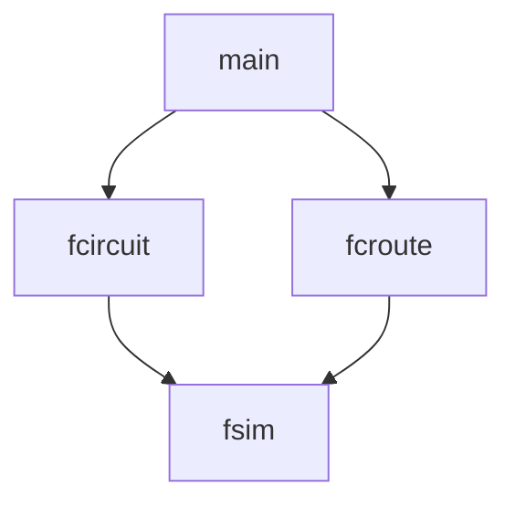

A cli from the perspective of the Designer role in the [[User Stories.canvas|User Stories]]. 

# main
When the Designer runs `fcircuit`, this component constructs a blank `fcircuit`, or constructs a circuit from the given file.
## sn_id
A string that is unique under a `sn_id_manager`. StringName is the equivalent primitive type in Godot. In a good implementation, this collapses to an integer.
# fcircuit module
`fcircuit` satisfied the Simulator user stories for circuits, gates, and wires, excluding the routing and actual simulation.
## fcircuit\<S, T>
The `fcircuit` structure stands for "file-circuit" or "flex-circuit". It acts as both a class for circuits that can be used by other Developers. 

For prototyping, all `gate` are assumed to be a hard-coded set.

`S` is the state time.

`T` is the timestep unit, or just float for unitless. Gates must implement their operations on `S` and `T` must implement the basic numeric operators.

### fcircuit I/O
1. Construct a circuit from a file path. Throws an error if the given path contains a circuit with the wrong type.
	1. `fcircuit(string path)`. 
2.  Save a circuit either to the path it was loaded from or to another path.
	1. `int save(string path)`, 
	2. `save()`.
### fcircuit gates
3. Add a gate to the circuit under `label`. Can fail if `label` is already in the system. If `label` is not provided, a random label is assigned.
	1. `int add_gate(gate<S> &g, const sn_id label)`
	2. `int add_gate(gate<S> &g)`
4. Remove a gate under `label`.
	1. `int remove_gate(const sn_id label)`. 
5. Return a gate under `label` if it exists.
	1. `const option<gate<S> &> get_gate(const sn_id label)`. 
6. Returns all labels currently assigned to gates.
	1. `const vector<const sn_id> &list_gates()`. 
### fcircuit wires and nets
7. Add a wire to the circuit with an optional label. Optional label has the same behavior as in `add_gate`. All wires on a given pin are consolidated into a net.
	1. `int add_wire(const pair<const sn_id, const sn_id> from, const pair<const sn_id, const sn_id> to, const sn_id label)`, 
	2. `int add_wire(const pair<const sn_id, const sn_id> from, const pair<const sn_id, const sn_id> to)`. 
8. Remove a wire, either by its label or by a start and end point.
	1. `int remove_wire(const sn_id from, const sn_id to)`, `int remove_wire(const sn_id label)`. 
9. List wires by label.
	1. `const vector<const pair<const sn_id, const sn_id>> &list_wires()`. 
10. List nets.
	1. `const vector<const net<S>&> &list_net()`. 
11. Loads routing data from the input file into an `fsim`.
	1. `fsim &create_sim()`. 
## gate\<S, T>
Each `gate` is a hard-coded single instance of a gate type.
1. Structure describing the inputs and outputs of this type
	1. `const pinout pins`. 
2. Function pointer to the solver.
	1. `const solver<S, T> solve`. 
3. The readable name of the gate type. `gate_manager` ensures no two gates have the same name under the same manager.
	1. `const sn_id name`. 
## net\<S, T>
Each `net` represents a cluster of wires that share a value. When any of their pins drive a wire, the net will incorporate the event and share it to all of its endpoints. Technically, `net` "inherits" from `gate` with an empty pinout.
1. The endpoints of the net.
	1. `vector<const pair<const sn_id>> endpoints` 
## pinout
A `pinout` describes the structure of the inputs and outputs to a `gate`. 
1. For now, just a size should be sufficient. Since each gate is responsible for its solver, each gate knows which pin is which. But, a list of labels allows for much easier debugging.
	1. `const vector<const sn_id> labels`.  
To make `net` possible as a gate variant, an empty pinout suggests a variable number of pins.
## solver\<S, T>
A function pointer describing the behavior of a gate.
1. Returns a queue of events.
	1. `const fcevents<S, T> solver(const vector<S> &states)` 
## fcevents\<S, T>
File circuit events. A priority queue of `event<S>` ordered by minimum `delay`.
1. View the next event
	1. `event<S, T> &pop_min()`
	2. `const event<S, T> &peak_min()`
2. Merge an event queue. If `time` is provided, the delay of every event is offset by it, allowing for a time-series append.
	1. `void merge(const fcevents<S, T> &with)`, 
	2. `void merge(const fcevents<S, T> &with, T time)`. 
## event\<S>
1. `const T time`
2. `const net &drive`
3. `const S value`
# fcroute module
## fcstream\<S, T>
An input or output stream that can be routed to an `fcircuit` by an `fsim`. An iterable that can iterate over changes in value or over its value on a certain step.
1. Returns the step size of the stream. 
	1. `T get_step_size()`. 
2. Returns the endpoints this stream will have when attached to a circuit.
	1. `vector<pair<const sn_id, const sn_id>> &get_endpoints()`. 
3. Loads a stream from a path. Acceptable types: See [[File Types Research]]
	1. `fcstream(string path)`. 
4. Loads a stream from iterable samples and a step size. 
	1. `fcstream(iterable<S> core, T step)`. 