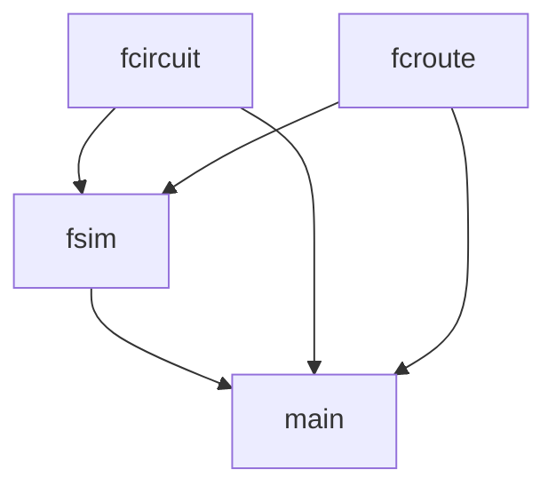
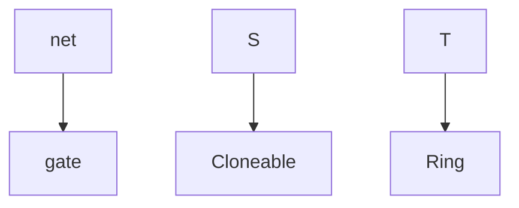

A cli from the perspective of the Designer role in the [[User Stories.canvas|User Stories]]. Works at a high level for either of the [[Possible approaches]]. 

I'm writing here in a mix of C++ and Rust syntax. The main point is to clearly convey the typing of the system.

 This layout shows pretty clearly that the HDL approach may be more difficult, since the functions below are functions I would want to include regardless of approach and extra functions would be needed to implement hdl conversion. Though any of the ways file IO could be handled may come with their own helper functions.

# Object diagram

# Inheritance diagram

# Critiques
If `fsim` is not fast enough, it may be necessary to come up with an indexing scheme other than `sn_id` for gates that packs objects more closely together, or there might be some other bottleneck in the simulator. Note that the construction of circuits and routes goes through `fsim` first, so it can lay out the component objects in memory however it likes and distribute them to `fcircuit`.

The dependencies are a little dense, since the main program could expose functionality in the component types. It leaves an unanswered question of whether `fsim` exposes its components directly or if `main` can be run in different modes to access different object types directly.

The id system for wires is unclear. It's possible that either the nets themselves store the labeling of individual wires, or that this is up to the `fcircuit`. I'm trying to be more clear that this should be the circuit's responsibility, but that doesn't really get conveyed. The solution is probably to have a "trivial" id space for pins ("A", "B", "C" etc.). Nodes, or individual pins, are a first class type in the verilog standard that is not respected here. Adding them would increase interface complexity and possibly memory impact as well, but it might actually make the code more simple, and may make more sense to users. 

With now formal notion of a trace, it's impossible to associate values generated by `events` to values in the circuit. However, the trace structure should be pretty easy to implement. If the events are simply stored in an array, in order of time, that would be sufficient data to project states back onto the circuit when viewing the state or playing it back without modification.

`fsim` has too many responsibilities within the system, and should be split up somehow.
# main
When the Designer runs `fcircuit`, this component constructs a blank `fcircuit`, or constructs a circuit from the given file.
## sn_id
A string that is unique under a `sn_id_manager`. StringName is the equivalent primitive type in Godot. In a good implementation, this collapses to a pointer.

Each id should be human-readable. This should lead to much easier debugging.
## I/O
Save a load files into a simulator, generating a circuit and routes as needed.
1. Load a simulation from a file path, adding it to the running program. The file may contain circuit data, stream data, and simulation state.
	1. `int load(string path)`.
2. Save a simulation from a file path. If `checkpoint` is true, the simulation's state is encoded along with the active circuit and routes.
	1. `int save(string path, bool checkpoint)`.
# fcircuit module
`fcircuit` satisfies the Simulator user stories for circuits, gates, and wires, excluding the routing and actual simulation.
## fcircuit\<S, T>
The `fcircuit` structure stands for "file-circuit" or "flex-circuit", and represents a circuit of gates and connections.

For prototyping, all `gate` are assumed to be a hard-coded set.

`S` is the state time.

`T` is the timestep unit, or just float for unitless. Gates must implement their operations on `S` and `T` must implement the basic numeric operators.

### fcircuit I/O
1. Construct a circuit from a file path. Throws an error if the given path contains a circuit with the wrong type. 
	1. `fcircuit(string path)`. 
 > 	NOTE: In Godot, resources are not loaded with constructors, but rather the ResourceLoader singleton, which has a standard system for unpacking objects, determining their type, then returning the object to the user. This is worse for type safety, but loading outside of a constructor is better for standardization and code clarity (`load` is a better name than `fcircuit`).
2.  Save a circuit either to the path it was loaded from or to another path.
	1. `int save(string path)`, 
	2. `save()`.
### fcircuit gates
3. Add a gate to the circuit under `label`. Can fail if `label` is already in the system. If `label` is not provided, a random label is assigned.
	1. `int add_gate(gate<S> &g, const sn_id label)`
	2. `int add_gate(gate<S> &g)`
4. Remove a gate under `label`.
	1. `int remove_gate(const sn_id label)`. 
5. Return a gate under `label` if it exists.
	1. `const option<gate<S> &> get_gate(const sn_id label)`. 
6. Returns all labels currently assigned to gates.
	1. `const vector<const sn_id> &list_gates()`. 
### fcircuit wires and nets
Under the hood, nets may share a labeling space with gates, since they are technically gates themselves. Note also that this is different from labeling wires. This could actually be beneficial because the labeling communicates which wires are independent.
7. Add a wire to the circuit. All wires on a given pin are consolidated into a net with integer ids. The full id of a wire is then a combination of its net id with its index in the net. Returns codes for the wire already existing, or the label already existing.
	1. `int add_wire(const pair<const sn_id, const sn_id> from, const pair<const sn_id, const sn_id> to, const sn_id label)`, 
	2. `int add_wire(const pair<const sn_id, const sn_id> from, const pair<const sn_id, const sn_id> to)`. 
8. Remove a wire, either by its label or by a start and end point.
	1. `int remove_wire(const sn_id from, const sn_id to)`,
	2. `int remove_net(const sn_id label)`. 
9. List wires by endpoints.
	1. `const vector<const pair<const sn_id, const sn_id>> &list_wires()`. 
10. Get a net.
	1. `const const net<S,T> &get_net(sn_id label)`
11. List nets.
	1. `const vector<const sn_id> &list_net()`. 
## gate\<S, T>
Each `gate` is an immutable single instance of some type of gate's behavior. For example, this structure could store the notion of an "AND" gate.
1. Structure describing the inputs and outputs of this type
	1. `const pinout pins`. 
2. Function pointer to the solver.
	1. `const solver<S, T> solve`. 
3. The readable name of the gate type. `gate_manager` ensures no two gates have the same name under the same manager.
	1. `const sn_id name`. 
## net\<S, T>
Each `net` represents a cluster of wires that share a value. When any of their pins drive a wire, the net will incorporate the event and share it to all of its endpoints. Technically, `net` can "inherit" from `gate` with an empty pinout, since nets, too, have pins.
1. The endpoints of the net.
	1. `vector<const pair<const sn_id>> endpoints` 
## pinout
A `pinout` describes the structure of the inputs and outputs to a `gate`. 
1. For now, just a size should be sufficient. Since each gate is responsible for its solver, each gate knows which pin is which. But, a list of labels allows for much easier debugging.
	1. `const vector<const sn_id> labels`.  
To make `net` possible as a gate variant, an empty pinout suggests a variable number of pins.
## solver\<S, T>
A function pointer describing the behavior of a gate.
1. Returns a queue of events that the gate produces after being given this list of states, ordered to respect their pinout.
	1. `const fcevents<S, T> solver(const vector<S> &states)` 
## fcevents\<S, T>
Circuit events. A priority queue of `event<S>` ordered by minimum `delay`.
1. View the next event
	1. `event<S, T> &pop_min()`
	2. `const event<S, T> &peak_min()`
2. Merge an event queue. If `time` is provided, the delay of every event is offset by it, allowing for a time-series append.
	1. `void merge(const fcevents<S, T> &with)`, 
	2. `void merge(const fcevents<S, T> &with, T time)`. 
## event\<S, T>
One event to resolve a  and get any followup events from it.
1. `const T time`
2. `const sn_id &drive`
3. `const S value`
# fcroute module
Route data structure, the actual Route requirements are satisfied in the fsim module.
## fcstream\<S, T>
An input or output stream that can be routed to an `fcircuit` by an `fsim`. An iterable that can iterate over changes in value or over its value on a certain step.
1. The step size of the stream. This is the step size the last time the stream was written to by a simulation, and is only used for playback.
	1. `T get_step_size()`
2. Loads a stream from a path. Acceptable types: See [[File Types Research]]
	1. `fcstream(string path)`. 
3. Loads a stream from iterable samples and a step size. 
	1. `fcstream(iterable<S> block, T step)`. 
4. Get the next value in the iterable.
	1. `S next()`
# fsim module
Satisfy the Route, Simulator, and Scoring requirements.

The job of `fsim` is to take a circuit and streams and actually run a simulation. In the previous implementation, it's job was to pack the memory layout of the relevant objects closely, so the simulation can retain locality. However, this neglects its most basic purposes of managing the simulation loop, offering debugging interfaces, and writing to outputs.

This is also the most important part to test for efficiency. 
## fsim\<S,T>
### Setup
1. Set the circuit. If the circuit is the same as the previous circuit, this will force the simulation to acknowledge any changes it might have missed.
	1. `void update_circuit(const fcircuit<S,T> &circuit)`
2. Get the circuit.
	1. `option<const fcircuit<S,T> &> get_circuit()`
3. Add an input stream. If a route is already connected, the route will be driven multiple times on each cycle in the order that the streams were added. If a stream is routed multiple times it will be routed to multiple nets. But each combination of stream and route is unique.
	1. `void add_route_in(const pair<fcstream<S,T> &stream, const pair<const sn_id, const sn_id> route>)`.
4. Remove an input stream. Returns true if the stream was found.
	1. `int remove_route_in(const pair<fcstream<S,T> &stream, const pair<const sn_id, const sn_id> route>)`
5. Get the existing input streams and routes.
	1. `const vector<const pair<fcstream<S,T>, const pair<const sn_id, const sn_id>>> get_routes_in()`
6. Get the existing routes for a given stream.
	1. `const vector<const pair<const sn_id, const sn_id>> get_routes_in(const fcstream<S,T> &stream)`
7. Get the existing input streams for a given route.
	1. `const vector<const fcstream<S,T> &> get_streams_in(const pair<const sn_id, const sn_id> route)`
8. Repeat input functions, but for output streams instead.
9. Repeat input functions, but for desired output streams instead.
10. Set the step size for the simulation. All streams are assumed to update at this rate.
	1. `T step_size`
### Simulation
10. Get the current event queue of the simulation.
	1. `const fcevents<S,T> &get_queue()`
11. Get the current time from start in the simulation. This is equivalent to the current time before the last event propagation, plus the wait time of the event queue.
	1. `const T get_time()`
12. Step through one event propagation, keeping the next set of events in memory. Returns 1 if the step size is reached. 
	1. `int substep()`
	2. When step size is reached, the outputs are written to and the next sample of each of the inputs is added to the event queue with no delay.
	3. If the events 
13. Step through one timestep's worth of events.
	1. `int step()`
14. Get the current score of the simulation. Up to the current `get_time()`, that's the ratio of matching elements between the desired streams and the matching output streams to non-matching elements.
