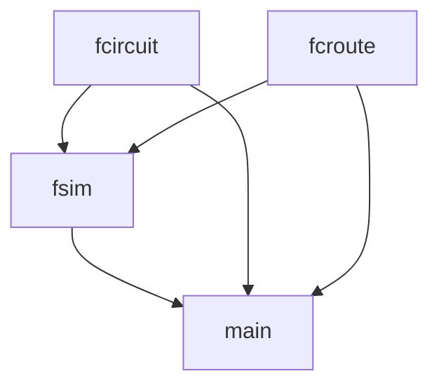
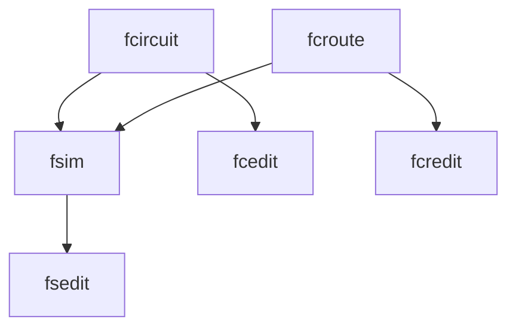
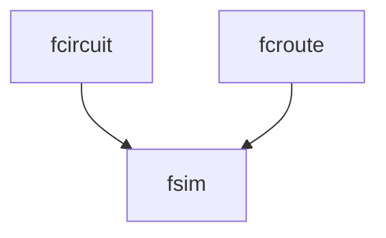

The main module could be split into unique programs for manipulating each part of a circuit. This would preserve better architectural isolation in the design.

# Current Object Diagram

Becomes:

It may be worth it for the original design architecture, if there is going to be a one-to-one correspondence, to simply assume there is no program interface. This would effectively replace the Designer with the Developer, since there is no cli interface, but would have no effect on the design's effectiveness as a library. Once the game editor is placed on top of these tools, the Designer would come back in, so it wouldn't actually result in much of a mutation in the requirements.

Becomes (until further notice):

