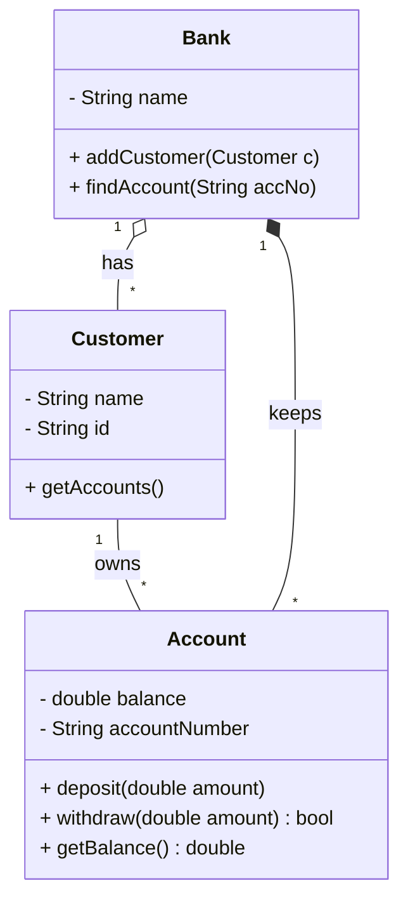

```mermaid
classDiagram
    class Account {
        - double balance
        - String accountNumber
        + deposit(double amount)
        + withdraw(double amount) bool
        + getBalance() double
    }
    class Customer {
        - String name
        - String id
        + getAccounts()
    }
    class Bank {
        - String name
        + addCustomer(Customer c)
        + findAccount(String accNo)
    }
    Customer "1" -- "*" Account : owns
    Bank "1" o-- "*" Customer : has
    Bank "1" *-- "*" Account : keeps

```
