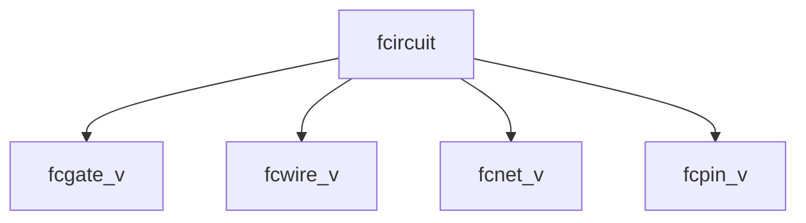

The fcircuit module could benefit from being split into a core class and multiple controllers. One for pins, one for gates, one for wires, and one for nets. View of the state of the circuit would be reserved for the simulator. This issue arises because of the unclear wire labeling scheme. This would assume a sort of Model-View-Controller architecture with the view being the unspecified game part of the design.

This change also inverts the inheritance relation between nets and gates. A net is now a base type for a behavior that is associated with pins in a circuit, instead of a subtype of a behavior that owns pins, giving more segregation between the gate/net system and the circuit system.
# Object diagram

# fcircuit module updates
Each view manages its own association between objects and labels, taking a lot of load off of the circuit and expanding its capability.
## fcgate_v\<S,T>
Add, remove, get and list gates by their label. Added and removed gates induce pins to be added and removed, and mapped to the gates such that the simulator can pass relevant nets to each solver.
1. Add a gate to the circuit under `label`. Can fail if `label` is already in this view. If `label` is not provided, a trivial label is assigned.
	1. `int add_gate(gate<S,T> &g, option<const sn_id> label)`
2. Remove a gate under `label`.
	1. `int remove_gate(const sn_id label)`. 
3. Return a gate under `label` if it exists.
	1. `const option<gate<S,T> &> get_gate(const sn_id label)`. 
4. Returns all labels currently assigned to gates.
	1. `const vector<const sn_id> &list_gates()`. 
## fcpin_v
Add, remove, get and list pins by their label. Each pin belongs to at most one gate. If the circuit is only edited through these controllers, each pin will belong to exactly 1 gate and at most 1 net.
1. Get connections associated with a pin at `label`
	1. `const vector<const net &> &get_connections(const sn_id label)`
2. List all pins.
	1. `const vector<const sn_id> list_pins()`
## fcwire_v
Add, remove, get and list wires by their label and pin endpoints. Wires belonging to the same cluster of pins are consolidated into the same net and the net is assigned an id trivially.
1. Add a wire to the circuit. The full id of a wire is a combination of a label and two pin labels.
	1. `int add_wire(const pair<const sn_id, const sn_id> endpoints, option<const sn_id> label)`, 
2. Remove a wire, either by its label or by a start and end point.
	1. `int remove_wire(const pair<const sn_id, const sn_id> endpoints)`,
	2. `int remove_net(const sn_id label)`. 
3. Get a wire id by its endpoints.
	1. `option<const sn_id> get_wire_id(const pair<const sn_id, const sn_id> endpoints)`
4. Get a wire's endpoints by its id.
	1. `const pair<const sn_id, const sn_id> get_wire_endpoints(const sn_id label)`
5. List wires by endpoints.
	1. `const vector<const pair<const sn_id, const sn_id>> &list_wire_endpoints()`. 
6. List wires by ids
	1. `const vector<const sn_id> &list_wire_ids()`
## fcnet_v
Add, remove, get and list nets by their label and endpoints. A valid circuit can always have its wires displayed, and a net may not correspond to wires directly, so the nets cannot be edited directly.
7. Get a net.
	1. `const const net<S,T> &get_net(sn_id label)`
8. List nets.
	1. `const vector<const sn_id> &list_net()`. 
## fcircuit
Associate gate/net pinout indices to pins. All other connections are secondary to simulation and thus are managed exclusively by their controllers.
1. `map<const sn_id, vector<pair<const net &, int>>> circuit`
Associate gate/net ids to pin layouts.
2. `map<const sn_id, pair<const net &, vector<const sn_id>>> gates`
## net\<S,T>
A net has some default transformation of a state that drives it, typically with very low or zero delay. It has no pinout configuration or name, but does have a solver.
1. `const solver<S,T> solve`
## gate\<S,T>
Inherits/composes `net`. Comes with a pinout allowing the solver to distinguish pins in simulation and a unique type name.